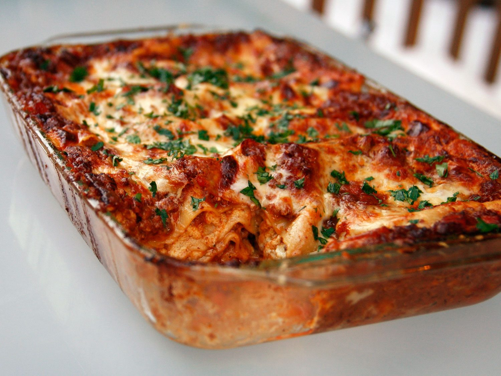

# Ingredients

* 100 ml extra virgin olive oil
* fine sea salt, to taste
* freshly ground black pepper, to taste
* 50 g butter
* 1 onion, finely diced
* 1 carrot, finely diced
* ½ celery stalk, finely diced
* 1 garlic clove, finely diced
* 1 rosemary sprig, picked
* 1 teaspoon dried oregano
* 600 g portovello mushrooms, sliced
* 400 ml red wine
* 400 ml good-quality tomato passata (pureed tomatoes)
* 25 g fresh truffle, thinly sliced or 2 tsp white truffle oil
* 750 ml béchamel sauce
* 300 g fresh pasta sheets (homemade or bouht)
* 150 g freshly rated Parmiiano Reiano cheese
* 650 ml whole milk
* 325 ml pouring (whipping) cream
* 65 g salted butter, chopped
* 65 g plain (all-purpose) flour

# Directions

1.  ¼ tsp fine sea salt
1.  Firstly, prepare the béchamel sauce. Place the milk and cream in a saucepan over a high heat and bring to the boil. In the meantime, you can make the roux. To do this, melt the butter in a separate saucepan over a low heat. Take off the heat, add the flour and mix with a wooden spoon until well combined. Return the saucepan to the heat and stir continuously for one minute. Add the hot milk in stages, stirring at each stage until the mixture is smooth. Once all of the milk is added, add the Parmigiano Reggiano cheese and salt. Cook over a low heat for approximately ten minutes or until the sauce thickens and coats the back of a wooden spoon. Pass through a sieve to ensure any lumps are removed. Place to one side.
1.  Preheat the oven to 180?C/gas mark four. In a large frying pan, heat half of the extra virgin olive oil over a high heat and fry the chicken livers until sealed. Remove from the pan, season with the sea salt and black pepper to taste, and set aside.
1.  Heat the butter and remaining extra virgin olive oil in a large saucepan over medium heat. Sauté the vegetables, garlic and herbs until the onion and garlic becomes translucent. Add the mushrooms and sauté until all the liquid has evaporated. Add the red wine and reduce by half. Add the tomato passata and simmer for ten minutes. Add the sealed chicken livers and truffle oil (if not using fresh truffle). Check seasoning and set aside.
1.  To make the lasagne, grease a 24 x 20 x 5 centimetre baking dish. Reserve 150 millilitres of the béchamel for the topping. Spread the base with a little of the chicken liver ragù. Place some of the pasta sheets on the bottom of the dish, followed by a quarter of the chicken liver ragù and a quarter of the remaining béchamel. Place some very thin slices of truffle (if not using truffle oil) on top of the béchamel sauce. Repeat three times. Top the lasagne with the reserved béchamel, Parmigiano Reggiano cheese and more truffle. Bake for approximately 20-30 minutes or until the cheese has turned golden brown. Serve hot or reheat later.Pasta Artigiana
