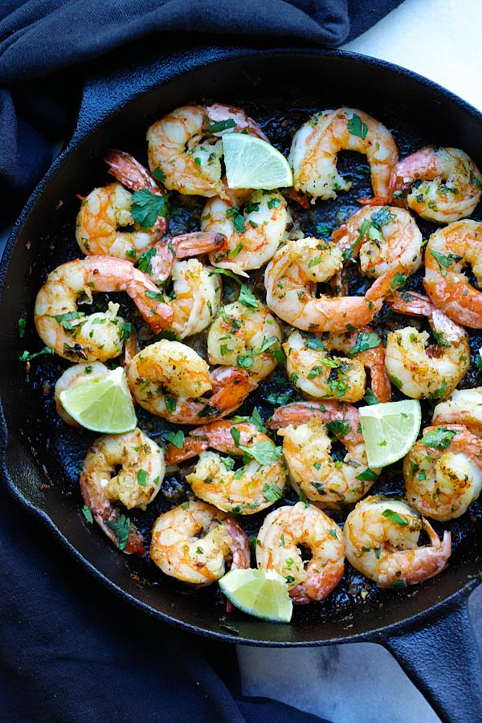

# Ingredients

* 11 / 2 pounds peeled and deveined jumbo shrimp
* 1/4 teaspoon plus 1/8 teaspoon ground cumin
* Kosher Salt and freshly ground black pepper
* 2 teaspoons extra-virgin olive oil
* 5 garlic cloves, crushed
* 2 tablespoons lime juice (from 1 medium lime)
* 3 to 4 tablespoons chopped fresh cilantro

# Directions

1.  Season the shrimp with cumin, and salt and pepper to taste.
1.  Heat a large nonstick skillet over medium-high heat.
1.  Add 1 teaspoon of the oil to the pan, then add half of the shrimp. Cook them undisturbed for about 2 minutes. Turn the shrimp over and cook until opaque throughout, about 1 minute. Transfer to a plate.
1.  Add the remaining 1 teaspoon oil and the remaining shrimp to the pan and cook, undisturbed, for about 2 minutes. Turn the shrimp over, add the garlic, and cook until the shrimp is opaque throughout, about 1 minute.
1.  Return the first batch of shrimp to the skillet, mix well so that the garlic is evenly incorporated and remove the pan from the heat.
1.  Squeeze the lime juice over all the shrimp. Add the cilantro, toss well, and serve.
