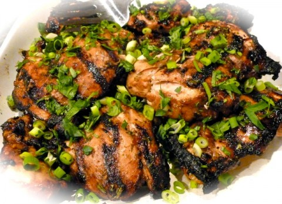

# Ingredients

* 1/4 cup(s) low sodium **soy sauce**
* 3 Tbsp **fresh** lime juice
* 2 tsp lime zest, finely minced
* 2 Tbsp ginger root, finely minced or grated
* 2 clove(s), medium garlic clove(s), minced
* 1 Tbsp honey
* 1 Tbsp chili oil, or other hot oil
* 1/4 cup(s) cilantro, fresh, chopped, divided
* 1 pound(s) uncooked boneless skinless chicken breast(s), four 4 oz pieces
* 2 Tbsp uncooked scallion(s), finely minced

# Directions

1.  In a large non-reactive bowl, combine soy sauce, lime juice, lime zest, ginger, garlic, honey, oil and 2 tablespoons cilantro; mix well. Remove and reserve 2 tablespoons of the marinade. Add chicken to bowl, tossing to make sure each piece is coated; refrigerate for 2 to 4 hours.
1.  Preheat broiler to high. Remove chicken from marinade and place in a baking dish; discard marinade. Broil chicken, 4 to 6 minutes; flip and brush chicken with reserved marinade. Return chicken to oven and broil until chicken is cooked through, about 4 to 6 minutes more.
1.  To serve, sprinkle chicken with scallions, remaining 2 tablespoons cilantro and any sauce accumulated in baking dish. Yields 1 chicken breast and about 1/3 cup sauce per serving.
